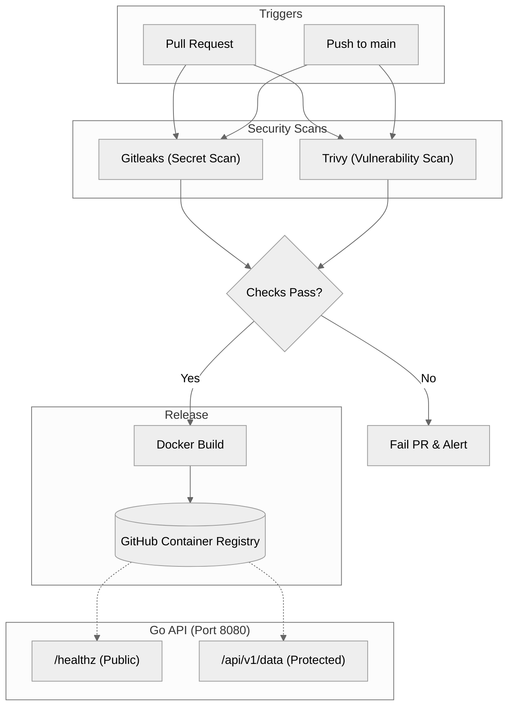

# Centuria

## Secure CI/CD Pipeline Demo

This project demonstrates an automated CI/CD pipeline using GitHub Actions to inspect incoming pull requests and prevent security risks from reaching production.

### Security Scanning

The pipeline runs automated checks on every pull request for the following

- Secrets Detection
  - The pipeline uses [Gitleaks](https://github.com/gitleaks/gitleaks) to detect 
    - exposed API keys
    - SSH keys, passwords
    - sensitive credentials
- Vulnerability Scanning
  - The pipeline uses [Trivy](https://github.com/aquasecurity/trivy) to identify vulnerabilities across dependencies and base container image layers.

If secrets or vulnerabilities are detected, the security check fails and surfaces the findings directly in the pull request and repository security alerts.

### Application & Deployment

The application is a containerized Go API featuring

- A public `/healthz` endpoint for uptime monitoring and health checks.
- A protected `/api/v1/data` endpoint secured via an API secret.

When all security checks pass, the pipeline automatically builds and publishes the production container image to the [GitHub Container Registry (GHCR)](https://github.com/hjg17/centuria/pkgs/container/centuria).

### Security Decisions

- Multi-Stage Builds
  -  Keeps the build toolchain out of the final runtime container to reduce image size and attack surface
- Pinned Base Images
  - Pinned to `golang:1.26-alpine3.24` and `alpine:3.24.1` for predictable and reproducible builds
-  Shift-Left Security
     - Runs Gitleaks and Trivy on every pull request to catch secrets and known vulnerabilities before code is merged
- Runtime Configuration
  - Passes the API key as an environment variable (`API_SECRET`) rather than storing it in code


### Running & Testing

#### Run the Container

```bash
docker run --rm -d -p 8080:8080 -e API_SECRET="<YOUR_SECRET>" ghcr.io/hjg17/centuria:latest
```

#### Test Endpoints

```bash
# Public health check
curl -i http://localhost:8080/healthz

# Protected endpoint (unauthorized)
curl -i http://localhost:8080/api/v1/data

# Protected endpoint (authorized)
curl -i -H "Authorization: <YOUR_SECRET>" http://localhost:8080/api/v1/data
```

### Architecture

